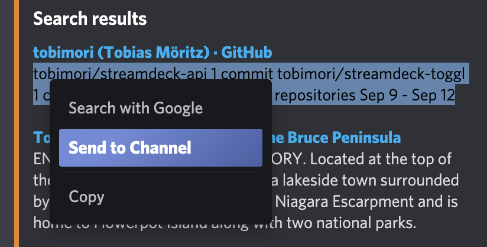

# SendToChannel (Powercord Plugin)

Adds a context menu entry that allows you to send your current selection into the active channel - even those from Clydes messages.



## Installation

Run 
```
git clone https://github.com/tobimori/powercord-sendtochannel
``` 
in Powercords plugins directory.